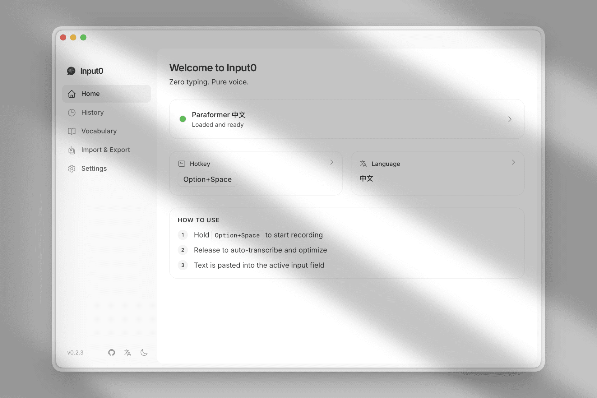

<div align="right">
  <strong>English</strong> | <a href="README.zh-CN.md">简体中文</a>
</div>

<div align="center">
  
  <h1>Input 0</h1>
</div>

> 🏗️ This project's AI agent harness is built with [Harness Engineering](https://github.com/10xChengTu/harness-engineering).

A macOS voice input tool — hold a hotkey to record, release to get polished text auto-pasted into any input field.

Local AI transcription → LLM text optimization → auto-paste. Private, fast, effortless.



## Features

- **Press & Speak** — Hold `Option+Space` (customizable) to record, release to transcribe + optimize + paste. No window switching needed.
- **Privacy-First Local STT** — Six AI engines (Whisper, SenseVoice, Paraformer, Moonshine, FireRedASR, Zipformer CTC) run entirely on your Mac via Metal GPU. Audio never leaves your device.
- **AI-Powered Polish** — LLM auto-corrects grammar, removes filler words, and structures your text. Built-in technical term correction (e.g. phonetic Chinese → "React"), with custom vocabulary support.
- **Auto-Paste Anywhere** — Optimized text is automatically pasted into your active input field — Slack, WeChat, VS Code, browsers, any app.
- **99+ Languages** — 6 engines, 12 models, covering 99+ languages. The system recommends the best model based on your language.
- **On-Demand Models** — Lightweight app, download only the STT models you need. One-click switch, progress display, smart recommendations.
- **ESC to Cancel** — Cancel at any stage (recording, transcribing, optimizing) by pressing ESC.
- **History** — Review past transcriptions with original and AI-optimized text side by side.
- **Custom Vocabulary** — Add professional terms, names, and product names. Auto-learning detects corrections and validates via LLM.
- **Dark & Light Themes** — Dual theme support to match your preference.
## System Requirements

- macOS 11.0+
- Apple Silicon processor recommended (for Metal GPU acceleration)

## Getting Started

### 1. Install

Download the latest `.dmg` from [GitHub Releases](https://github.com/nicepkg/input0/releases), open it, and drag **Input 0** into your Applications folder.

> On first launch, macOS may show a security warning. Go to **System Settings → Privacy & Security** and click **Open Anyway**.

### 2. Grant Permissions

Input 0 needs these macOS permissions to work properly. The app will prompt you on first launch:

| Permission | Why |
|---|---|
| **Microphone** | Records your voice |
| **Accessibility** | Simulates Cmd+V to paste text into other apps |

Go to **System Settings → Privacy & Security** to grant each permission, then restart the app.

### 3. Configure LLM API Key ⚡

> **This step is required.** Without an API key, voice transcription still works, but the AI text optimization (grammar fix, filler removal, structuring) will be skipped.

1. Open Input 0 → Click the **⚙️ Settings** icon in the sidebar
2. Find the **LLM API** section
3. Enter your settings:

| Field | Description | Default |
|---|---|---|
| **API Key** | Your OpenAI (or compatible) API key | *(empty — must fill in)* |
| **API Base URL** | Service endpoint | `https://api.openai.com/v1` |
| **Model** | LLM model name | `gpt-4o-mini` |

**Using a third-party provider?** (e.g. Azure OpenAI, Groq, local Ollama, or any OpenAI-compatible API)
- Change the **API Base URL** to your provider's endpoint
- Set the **Model** to your provider's model name
- Enter the corresponding **API Key**

Click **Test Connection** to verify your API key works.

### 4. Download an STT Model ⚡

> **This step is required.** You need at least one model to transcribe voice to text.

1. Open Input 0 → Go to **Settings** → **Model** section
2. The app recommends the best model based on your language setting — follow the recommendation or pick your own
3. Click **Download** next to the model you want
4. Wait for the download to complete (progress bar shown)

**Which model should I choose?**

| If you speak... | Recommended model | Size |
|---|---|---|
| Chinese | SenseVoice Small | ~228 MB |
| English | Whisper Large v3 Turbo | ~1.5 GB |
| Japanese / Korean | SenseVoice Small | ~228 MB |
| Cantonese | Paraformer Trilingual (zh/en/yue) | ~234 MB |
| Multiple languages | Whisper Large v3 | ~2.9 GB |
| Chinese SOTA (highest accuracy) | FireRedASR Large v1 | ~1.74 GB |
| Want the fastest | Moonshine Base (EN-only) | ~274 MB |
| Want smallest download | Whisper Base | ~142 MB |

### 5. Start Using

1. Press and hold **Option+Space** (or your custom hotkey)
2. Speak naturally
3. Release the key — your text is transcribed, polished, and auto-pasted

That's it! 🎉

## Troubleshooting

### Model Download Issues

If a model download fails or gets stuck:

1. **Check your network** — Models are downloaded from Hugging Face. If you're in a region where Hugging Face is slow or blocked, consider using a VPN or proxy.
2. **Retry** — Close and reopen the app, then try the download again. Partial downloads will resume from where they left off.
3. **Disk space** — Make sure you have enough free space. The largest model (Whisper Large v3) needs ~2.9 GB.
4. **Manual download** — As a last resort, you can manually download model files and place them in:
   ```
   ~/Library/Application Support/com.input0/models/<model-id>/
   ```
   See the [model registry](src-tauri/src/models/registry.rs) for exact file names and download URLs.

### No Text Output After Speaking

- Make sure at least one STT model is downloaded and selected
- Check that your **Microphone** permission is granted
- Check that **Accessibility** permission is granted (required for auto-paste)

### AI Optimization Not Working

- Verify your **API Key** is set correctly in Settings
- Click **Test Connection** to check the API is reachable
- If using a third-party provider, double-check the **API Base URL** and **Model** name

### Hotkey Not Responding

- Make sure no other app is using the same hotkey
- Try changing the hotkey in **Settings**
- Restart the app after changing the hotkey

## All STT Models

| Model | Size | Best For |
|-------|------|----------|
| Whisper Base | ~142 MB | Fast & lightweight, good for daily use |
| Whisper Small | ~466 MB | Balanced accuracy and speed |
| Whisper Medium | ~1.4 GB | Excellent multilingual accuracy |
| Whisper Large v3 | ~2.9 GB | Highest accuracy, 99 languages |
| Whisper Large v3 Turbo | ~1.5 GB | Top accuracy for English & multilingual |
| Whisper Large v3 Turbo Q5 | ~547 MB | Quantized high-accuracy, balanced size |
| SenseVoice Small | ~228 MB | Best for Chinese / Japanese / Korean |
| Paraformer Chinese | ~217 MB | Chinese-optimized, ultra-fast inference |
| Paraformer Trilingual | ~234 MB | Chinese + English + Cantonese (only Cantonese-capable model) |
| Moonshine Base (EN) | ~274 MB | English-only, ~5x faster than Whisper |
| FireRedASR Large v1 | ~1.74 GB | Chinese ASR SOTA (CER ≈ 2%), for maximum accuracy |
| Zipformer CTC (Chinese) | ~350 MB | Offline Chinese CTC, next-gen Kaldi, lightweight |

## License

This project is licensed under [CC BY-NC 4.0](https://creativecommons.org/licenses/by-nc/4.0/). You are free to share and adapt, but not for commercial use.
